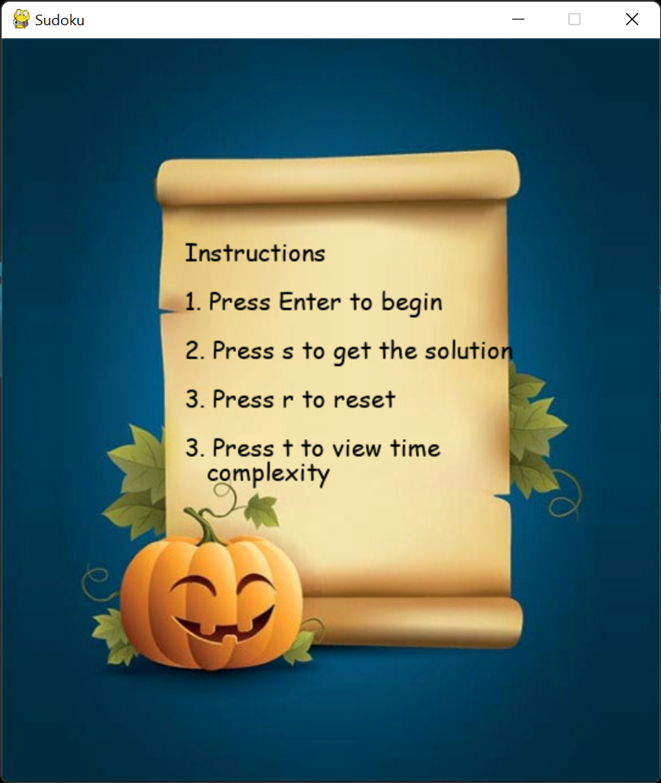

# Sudoku Game
---
Sudoku is a popular puzzle that requires you to fill blanks in a 9x9 grid with digits so that each column, each row and each of the nine 3×3 sub-grids contains all of the digits from 1 to 9. There have been various approaches to solving that, including computational ones. In this project, I have implemented the recursive backtracking algorithm as well as Crook's algorithm.

# Requirements
---
- python
- pygame

# Background
---
- The modern Sudoku was most likely designed anonymously by Howard Garns, a 74-year-old retired architect and freelance puzzle constructor from Connersville, Indiana, and first published in 1979 by Dell Magazines as Number Place (the earliest known examples of modern Sudoku). Garns's name was always present on the list of contributors in issues of Dell Pencil Puzzles and Word Games that included Number Place, and was always absent from issues that did not. He died in 1989 before getting a chance to see his creation as a worldwide phenomenon. Whether or not Garns was familiar with any of the French newspapers listed above is unclear.
- To read more about Sudoku and its origin, see [wikipedia](https://en.wikipedia.org/wiki/Sudoku)

# File Description
---
- sudokuSolver.py contains all the functions required to solve sudoku using recursive backtracking algorithm
- crooksAlgorithm.py contains functions required to solve sudoku by Crook's Algorithm
- crooksMain.py returns the solved puzzle using Crook's
- sudokuGenerator.py generates random sudoku puzzles
- sudokuGUI.py this is the main file that allows user to play the game via a pygame console

# Menu page
---

- Press r to reset the game. All  the values entered by user on board will be cleared.
- Press enter to begin the game.
- Press s to see the solution. Pressing s implements a visual solve.

# Game board
---

- Click on any of the boxes to select it.
- Pencil in temporary values.
- Press enter to check if a given value is valid
- A cross indicates entered value in not valid.

---
- Click on view solution to see the solution.

---
- Board is solved by both recursive backtracking as well as Crook's Algorithm.
- Time complexity is measured using time module in python and displayed on console.
- Press t to see the comparison of time complexities

---

